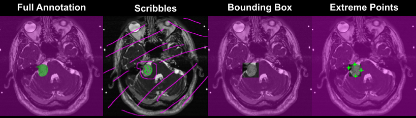

#  Inter Extreme Points Geodesics for End-to-End Weakly Supervised Image Segmentation

Public pytorch implementation for our paper [Inter Extreme Points Geodesics for End-to-End Weakly Supervised Image Segmentation](https://arxiv.org/abs/2107.00583), 
which was accepted for presentation at [MICCAI 2021](https://www.miccai2021.org). 

If you find this code useful for your research, please cite the following paper:

```
@article{InExtremIS2021Dorent,
         author={Dorent, Reuben and Joutard, Samuel and Shapey, Jonathan and
         Kujawa, Aaron and Modat, Marc and Ourselin, S\'ebastien and Vercauteren, Tom},
         title={Inter Extreme Points Geodesics for End-to-End Weakly Supervised Image Segmentation},
         journal={MICCAI},
         year={2021},
}
```

## Method Overview
We introduce InExtremIS, a weakly supervised 3D approach to  train a deep image segmentation network using particularly weak train-time annotations: only 6 extreme clicks at the boundary of the objects of interest. Our fully-automatic method is trained end-to-end and does not require any test-time annotations. 

*Example of weak labels for our use case of Vestibular Schwannoma (VS) segmentation. Magenta: Background. Green: VS:*
<p align="center">
  
</p>


## Virtual Environment Setup

The code is implemented in Python 3.6 using using the PyTorch library. 
Requirements:

 * Set up a virtual environment (e.g. conda or virtualenv) with Python >=3.6.9
 * Install all requirements using:
  
  ````pip install -r requirements.txt````
 * Install the cuda implementation of the permutohedral lattice and the CRF Loss.
````
cd ScribbleDA/Permutohedral_attention_module/PAM_cuda/
python3 setup.py build
python3 setup.py install --user
````
  

## Data

The data and annotations are publicly available. Details are provided in [data](/data/).

## Running the code
`train.py` is the main file for training the models.

Example 1: Training InExtreMIS with manual extreme points:
```` 
python3 train.py \
--model_dir ./models/manual_gradient_eucl_deep_crf/ \
--alpha 15 \
--beta 0.05 \
--weight_crf 0.0001 \
--mode extreme_points \
--label_postfix Extremes_man \
--img_gradient_postfix Sobel_man \
--path_labels data/extremes_manual/ \
--with_euclidean \
--with_prob
````
Example 2: Training InExtreMIS with simulated extreme points:
````  
python3 train.py \
--model_dir ./models/simulated_gradient_eucl_deep_crf/ \
--alpha 15 \
--beta 0.05 \
--weight_crf 0.0001 \
--mode extreme_points \
--label_postfix Extremes \
--img_gradient_postfix Sobel \
--path_labels data/T2/ \
--with_euclidean \
--with_prob
````

`inference.py` is the main file for run the inference:
````
python3 inference.py \
--model_dir ./models/manual_gradient_eucl_deep_crf/ 
````
 
## Using the code with your own data

If you want to use your own data, you just need to change the source and target paths, 
the splits and potentially the modality used.
